AIMS GUI Walkthrough
=====
The AIMS analysis pipeline has been used to analyze a wide range of molecular species, including TCRs, antibodies, MHC molecules, MHC-like molecules, MHC-presented peptides, viral protein alignments, and evolutionarily conserved neuronal proteins. The GUI is currently only capable of analyzing these first four molecular species, with more analysis options hopefully available in the future.

This section will provide a step-by-step walkthrough outlining how to use the AIMS Graphical User Interface (GUI) through screenshots of the app. The focus will be primarily on how to interface with the GUI, how files are saved when using the GUI, and tips and tricks for a smooth AIMS experience. Before starting the GUI, you may want to check out the :doc:`AIMS_basics` and review the :ref:`formatting` and :ref:`core`.

.. note::
   Some of the screenshots may differ slightly from the current AIMS GUI, but the walkthrough still captures the core features needed to understand the GUI

As a reminder, in the new pip-based installation of AIMS, the GUI is called from your current directory simply using:

.. code-block:: python

   aims-gui

When launching the GUI, this screen should be the first thing that you see:

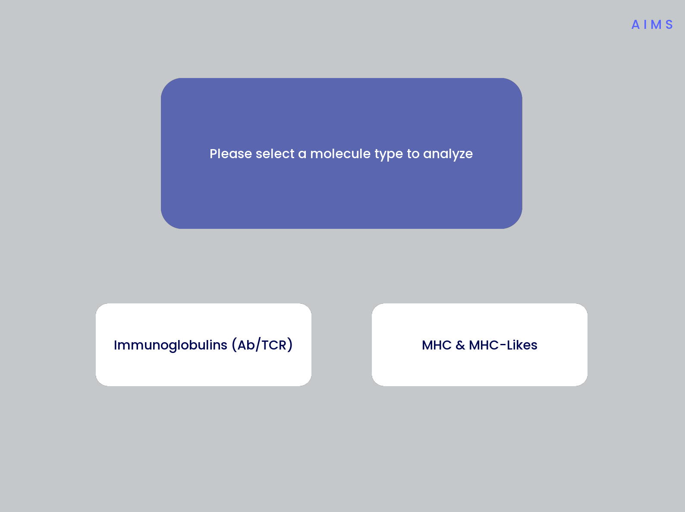

The navigation through the AIMS GUI is linear and button-based, allowing users to simply click through all of the analysis. If you'd like to analyze antibody (Ab) or T cell receptor (TCR) sequences, start with the :ref:`AIMSig` section. If you'd like to analyze MHC and MHC-like molecules, skip down to the :ref:`AIMSmhc` section.

.. _AIMSig:

Immunoglobulin Analysis with AIMS
------------
This section is specifically for the analysis of T cell receptors and antibodies. The analysis and formatting are identical for each of these receptor types, and one could even analyze these receptor types simultaneously, if for some reason one wanted to.

**Step 1: Loading in Data**

Assuming the input data is already properly formatted, everything should easily flow through the GUI and generate all data required. The first screen after selecting the Ig analysis should look like the first panel in the below image:

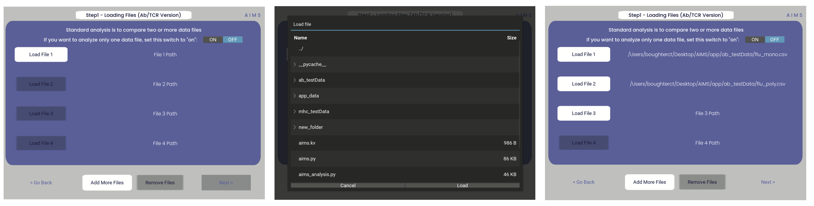

Once you click one of those light gray “Load File” buttons, you should get a screen that looks like the image in the second panel. From this, you can click through your directories and select the file you want to load in. If the file has been properly loaded, the File Path should be updated to reflect the file location.

.. note::
   If following along with this walkthrough, select the "test_data/abs" directory and load in flu_mono.csv and flu_poly.csv

If you would like to analyze only one dataset using AIMS, change the "ON/OFF" switch in the top right-hand corner to "ON". Otherwise, the AIMS GUI will require at least two datasets to be loaded into the analysis. Additionally, if the data of interest is spread across more than four files, click the "add more files" option to increase the number of file slots on the screen. As of AIMS_0.5.5, a max of 9 files may be analyzed at once.

**Step 2: Define Names and Outputs**

In this step, we define the folder which the outputs are saved to, the labels that will accompany the datasets in figure legends, and the number of CDR loops in the input data. Further, the AIMS GUI removes expanded clones and sequence duplicates by default. Uncheck the "Remove Expanded Clones" box if you'd like to include degenerate receptors.

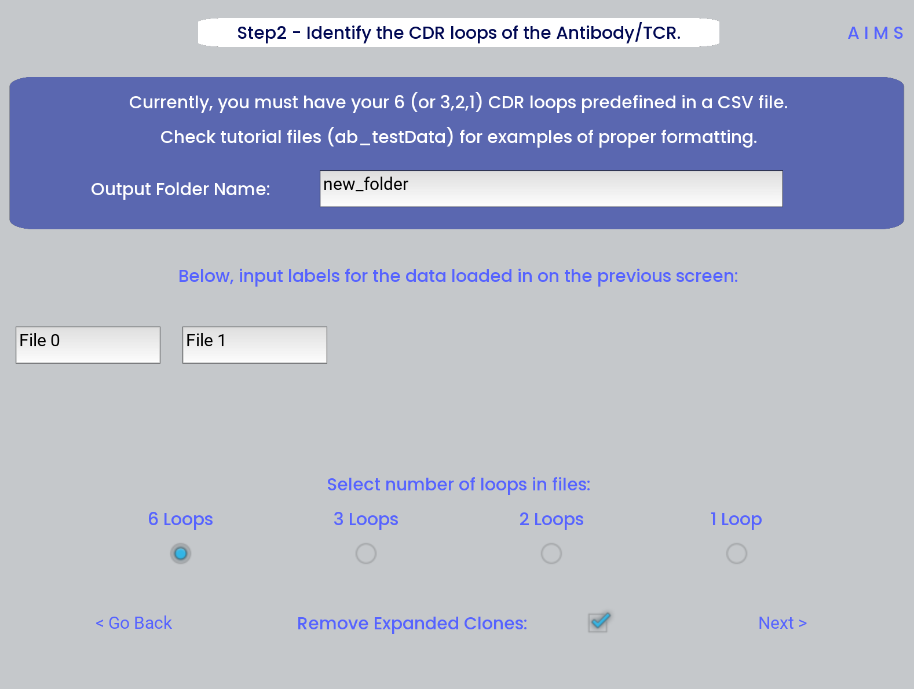

.. warning::
   Defining the output directory is very important, as by default files are overwritten if the AIMS analysis is run multiple times. Ideally each new run of AIMS should be output to a new directory, with a descriptive title.

**Step 3: Generate the Sequence Matrix**

In this step, we begin the dive in to the automated portion of the "Automated Immune Molecule Separator", generating an AIMS-encoded matrix form of the sequences in our dataset. Most steps from here on require a simple clicking of a button, here "Get Matrix", and moving on to the next step. Users are given the option to change the AIMS aligment scheme, with "Center Align" as the default option. See the :ref:`core` section of the documentation for more information on these alignment schemes. As an example, both the bulge alignment (center panel), and the central alignment (right panel) are highlighted below. 

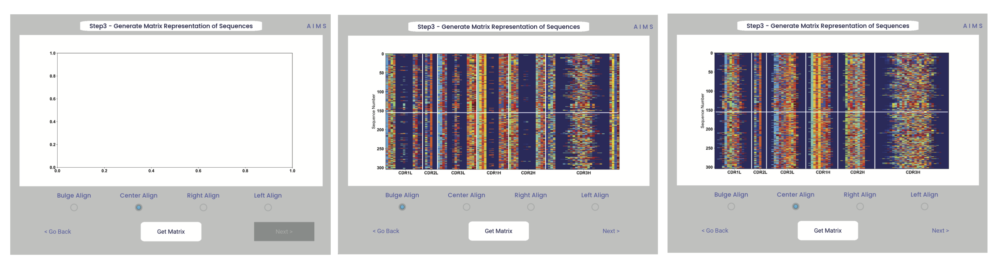

Congrats! You’ve generated your first piece of data using this software. You might notice that your image quality is poor for figures shown in the app, this is because the software shows *png files. Don’t worry, both a *png and a higher-quality *pdf version of the plot are saved in whichever directory you specified in Step 2. This is true for subsequently generated figures.

Additionally, as you move through the sequential steps of the GUI, keep in mind that **all generated figures have corresponding raw data saved to a *.dat file**, should the user want to re-plot the data using a different color scheme, different plotting application, etc. For screen 3, the output figures are matrix.png and matrix.pdf, while the ouput raw data is saved as raw_matrix.dat.

.. note::
   Whichever alignment is chosen at this step will be used for all downstream analysis from this point. In other words, analysis of the central alignment may be different from analysis of the left or right aligments.

**Step 4: Generate High-Dimensional Biophysical Matrix**

In this step, we generate the high-dimensional biophysical property matrix that will be used in all downstream analysis. We then have the option to include or exclude files from the clustering that will happen in the next step. If only one or two datasets are included in the analysis, all input data must be included in the clustering. Again, we simply press the “Generate Matrix” button, shown below, and then users can move on to the next step. 

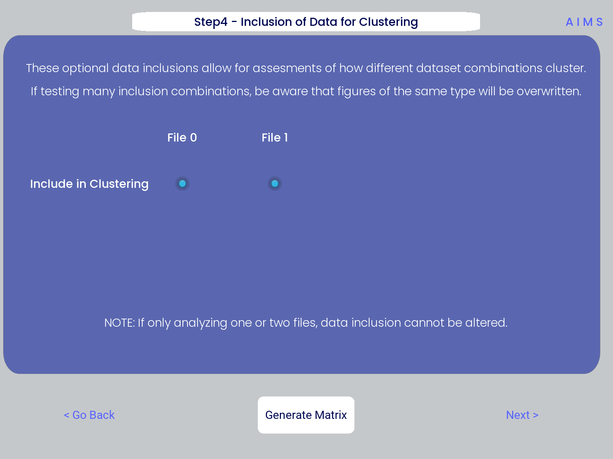

.. note::
   Don’t worry if this step takes a little while, especially for larger datasets. This will be the slowest and most memory-intensive step in the analysis.

While most users may not want to leave any datasets out of the clustering of Step 5, there are some interesting applications of AIMS where the exclusion of certain datasets has interesting impacts on receptor clustering. It is important to remember that the UMAP and PCA dimensionality reduction steps are strongly dependent on the input data. Learn more about this input data dependence in the :doc:`AIMS_cluster` section.

**Step 5: Dimensionality Reduction and Receptor Clustering**

The goal in this step is to take that large biophysical property matrix generated in the previous step, and reduce this high-dimensional matrix down to two or three composite dimensions, and then cluster the receptors projected onto this space based upon distance in this projected space. This step is perhaps the most involved in the GUI, with the most customizable options. Hence the dedicated :doc:`AIMS_cluster` section detailing the possibilities for this analysis. 

First, the user must decide if they would like to reduce dimensionality on Net Average Properties, i.e. the biophysical properties averaged across entire receptors, or on the Position Sensitive Properties, i.e. the amino acid biophysical properties at every position on every receptor.

Next, the algorithm used for this dimensionality reduction must be chosen. Users can choose either Principal Component Analysis (PCA) or Uniform Manifold Approximation and Projection (UMAP), and additionally choose to visualize these projections in two- or three-dimensions. Once these options are chosen, click the "Reduce Dim" button to visualize these options. More options can be tested and the projection re-visualized as many times as the user desires.

Lastly, the data is then clustered using one of three algorithms, either K-Means, OPTICS, or DBSCAN clustering. Users must also define, for each of these algorithms, a tunable parameter that determines the size of the clusters generated. We can see each of these options, and the default values for the tunable parameters, in the screenshots below.

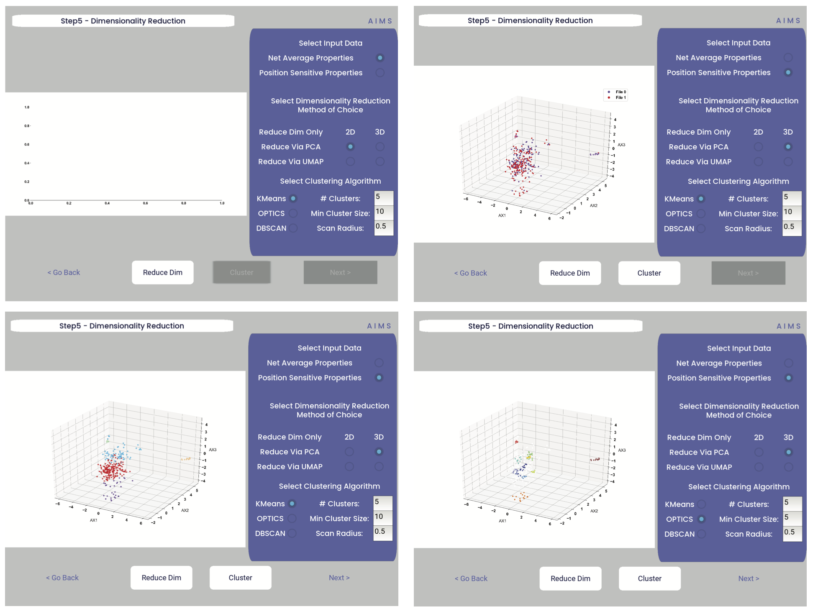

For more detail on how these dimensionality reduction and clustering algorithms work, as well as details on the tunable parameters, please see the :doc:`AIMS_cluster` section.

In the above screenshots, we see first the default screen (top left), then the three-dimensional PCA projection (top right), followed by a Kmeans clustering with 5 clusters (bottom left), and lastly an OPTICS clustering with a minimum cluster size of 5 (bottom right). Users should note that Kmeans will cluster all sequences in the dataset, while OPTICS and DBSCAN will exlude sequences that are not found at a sufficient density in the projection. These unclustered sequences are grayed out in the resultant displayed figure.

There is no one right answer to determining the "best" dimensionality reduction or clustering algorithm, so users are encouraged to try a range of options to determine which combination makes the most sense for their data. Importantly for this step, generated figures and data from each dimensionality reduction and clustering algorithm are **not overwritten**. You will see in the output directory descriptive filenames that correspond to each option used. Importantly however, for each given clustering algorithm only one file will be saved. If, for instance, you cluster your data using the Kmeans algorithm with "# Clusters" set to 5, then run it again with "# Clusters" set to 10, the output figures and data will reflect only the "# Clusters = 10" configuration. Lastly, raw data outputs "umap_3d.dat" or "pca_3d.dat" give the location of each sequence in the reduced dimensionality projection. Raw data outputs for the clustering steps "optics_3d.dat" or "dbscan_3d.dat" reflect the cluster membership of each given sequence, with the order of sequences preserved based upon your input datasets.

.. note::
   Whichever projection and clustering algorithm the user is currently viewing when moving to the next step is what will be used in all downstream analysis

**Step 6: Visualize and Analyze Clustered Sequences**

At this stage, we visualize the clustered sequences from the previous step. First, the user must hit the "Visualize Cluster" button, then after visual inspection of the clusters and sequences, the "comparison clusters" can be selected. The goal of this step is to determine whether the user wants to compare two biophysically distinct clusters which were identified in the previous step, or compare across the input datasets. We can see in the screenshot below how this works:

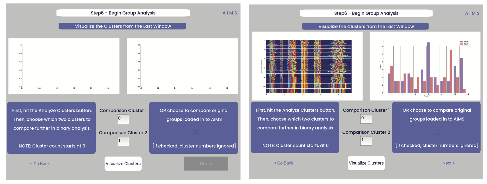

After the cluster visualization is complete, we see in the right panel, left figure that the matrix from step 3 is rearranged to reflect the clustered sequences, with higher sequence conservation (colors in the matrix) evident within each cluster. In the right figure, we see the sequence count of each input dataset in each cluster.

From this information, the user can determine which clusters they would like to analyze by entering values in the "Comparison Cluster" boxes. The cluster count starts at zero, and the user can infer the last cluster number from the figure on the right. The amino acid sequences from the selected clusters will be saved to the output directory as "clust2seq_#.txt" where the "#" is the cluster number for each respective dataset.

If the user instead is still most interested in comparing the input datasets, the checkbox on the right side of the screen can be checked, ignoring the clustering of the data (but still saving the results in the output directory!).

.. warning::
   The clustering algorithms are stochastic, and so cluster ID and cluster membership may change each time the software is run. For instance, in this walkthrough I use clusters 10 and 11 for downstream analysis, but users trying to replicate this analysis may have different sequences in clusters 10 and 11. This is important both for comparisons in this walkthrough as well as creating reproducible analysis.

**Step 7: Define Comparison Classes**

.. note::
   This screen is skipped when cluster analysis is chosen, rather than original group analysis

Here, we separate our loaded data into separate classes for downstream analysis, assuming the user opted not to compare clustered sequences. As a default, each loaded dataset is assigned to its own unique group, but the user may group these datasets however they choose by assigning matching group numbers to datasets they want analyzed together. For the immmunoglobulin analysis, the cluster comparison option is chosen, so this screen is not shown. To see the comparison class definition screen, jump to Step 7 in the :ref:`AIMSmhc`.

.. warning::
   If comparing more than two distinct groups, some of the analysis will be unavailble. These analyses include mutual information analysis, amino acid frequency characterization, and linear discriminant analysis. Each of these analyses require binary classifications of the data.

**Step 8: Visualize Averaged Position Sensitive Biophysical Properties**

In this step we look at average biophysical properties as a function of sequence space, part of our special “positional encoding”. At this stage in the walkthrough we won't bother showing the "before" snapshots of the GUI, as the only options are to press the button which generates the plot, and then move on to the next step. However, if you're trying to compare the results to the data we get in this walkthrough, the generated plots are quite useful:

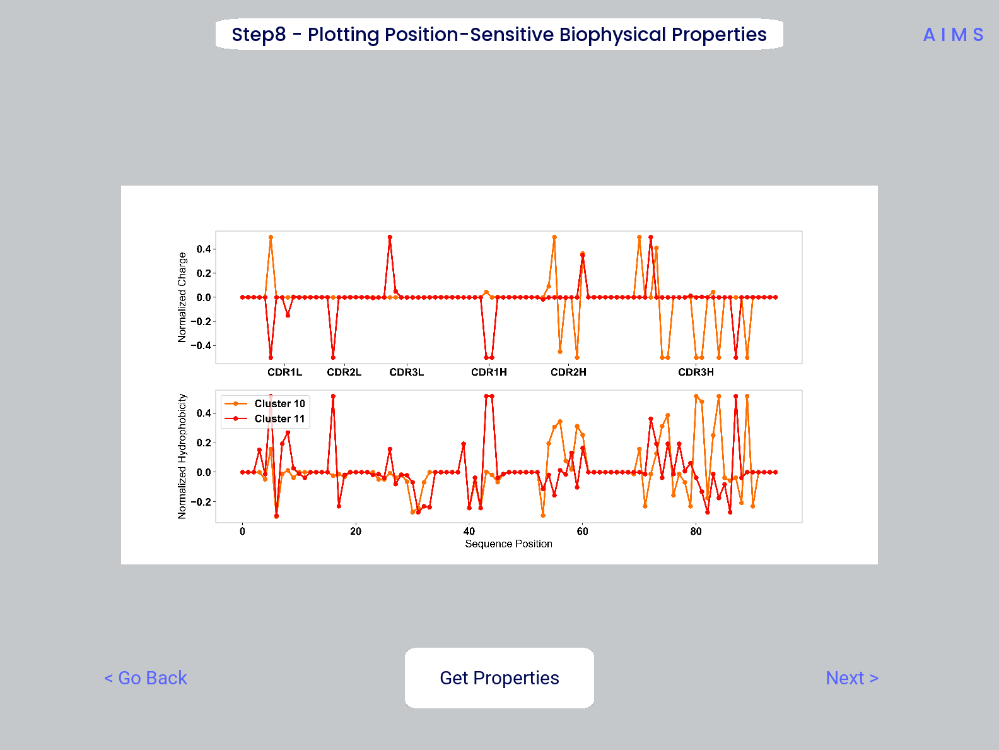

.. note::
   Standard deviations are not shown, and ideally these would be calculated via bootstrapping

The figure in this step is saved as "pos_prop.pdf/png", while the raw data is saved as "position_sensitive_mat#.dat" where the "#" again corresponds to the selected cluster number, or if comparing the original input datasets, the user-defined group number. This data file has as many rows as the number of sequences in the selected cluster or group, and has 61 x # AIMS positions columns. Ideally this data would be saved as a tensor of shape # sequences x 61 x # AIMS positions, however, this would require saving the data as a numpy object, which would be less friendly to other programming languages for replotting and reformatting. The 61 here refers to the 61 biophysical properties of AIMS (listed in the :ref:`bphysProp`). 

As a concrete example, cluster 10 in this walkthrough has 10 sequences, and 95 AIMS positions. So the first row of the position_sensitive_mat10.dat file here corresponds to the first sequence (which can be found in the "clust2seq_10.dat" output). The first 95 columns in this row correspond to the position sensitive charge (biophysical property 1 of 61). The next 95 columns correspond to the position sensitive hydrophobicity (biophysical property 2 of 61). And so on. 

**Step 9: Visualize Raw Position Sensitive Biophysical Properties**

In this step, we visualize the position sensitive charge for all clones, not averaged. This figure can help provide a sense of how reliable the averages of the previous step are. Like all biophysical properties in AIMS, the charge is normalized, hence the minimum and maximum on the scales not equaling 1.

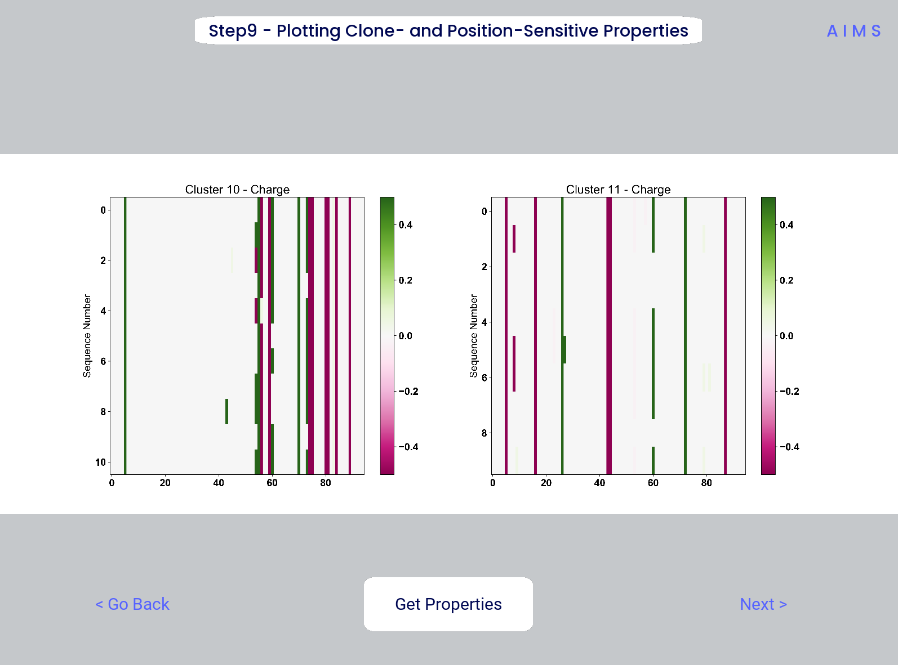

These figures are saved as "clone_pos_prop.pdf/png". This figure helps to understand the figure generated in Step 8, which is simply this figure averaged over the y-axis. It is additionally important to note that the positional encoding in Steps 8 and 9 are consistent with the alignment scheme selected in Step 3, either central, bulge, right, or left aligned.

**Step 10: Visualize Net Biophysical Properties**

In this step, we are averaging the biophysical properties over all positions and all receptors. In other words, effectively averaging the figures generated in Step 9 over both the x- and the y-axes. 

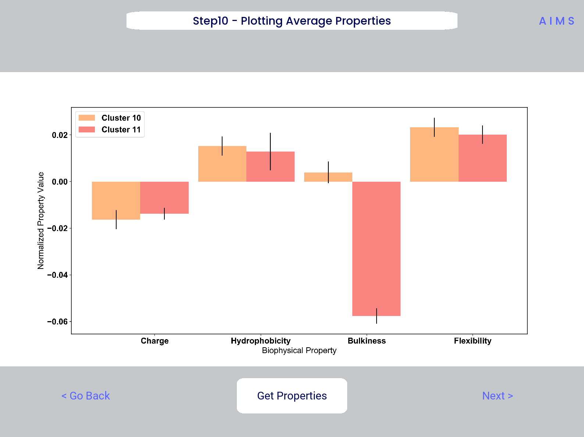

.. note::
   A large standard deviation in these plots are to be expected, especially if users are analyzing original input datasets rather than selected cluster subsets

This figure is saved as "avg_props.pdf/png", while statistical significance, as calculated using Welch's t-Test with the number of degrees of freedom set to 1, is saved as "avg_prop_stats.csv".

**Step 11: Calculate Shannon Entropy**

In this step, we are calculating the Shannon Entropy of the chosen datasets, effectively the diversity of the receptors as a function of position. For more information on the Shannon Entropy, as well as the Mutual Information discussed in the next step, view the Information Theory section of the :ref:`core`.

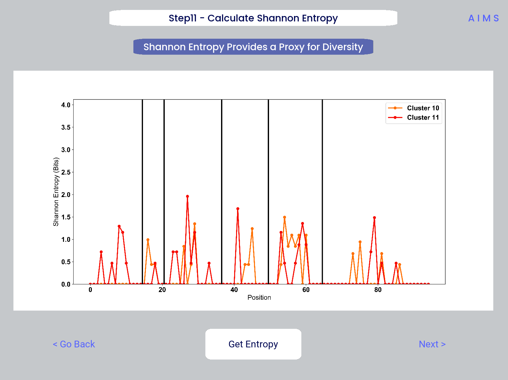

This figure is saved as "shannon.pdf/png".

.. note::
   Due to the requirement for a binary comparison in subsequent steps, this is the last GUI screen if users are comparing more than 2 groups

**Step 12: Calculate Receptor Mutual Information**

In this step, we calculate the mutual information between the individual posiitons in the AIMS matrix. The y-axis provides the "given" amino acid, and the x-axis provides the amount of information we gain at every other position when we know the amino acid identity at the "given" position. We present this data as a difference between the mutual information of group 1 and the mutual information of group 2. The y-axis is measured in "Bits" the fundamental unit of information, with a positive value (green) indicating higher mutual information in the first group (here "Cluster 10") and a negative value (pink) indicating higher mutual information in the second group (here "Cluster 11").

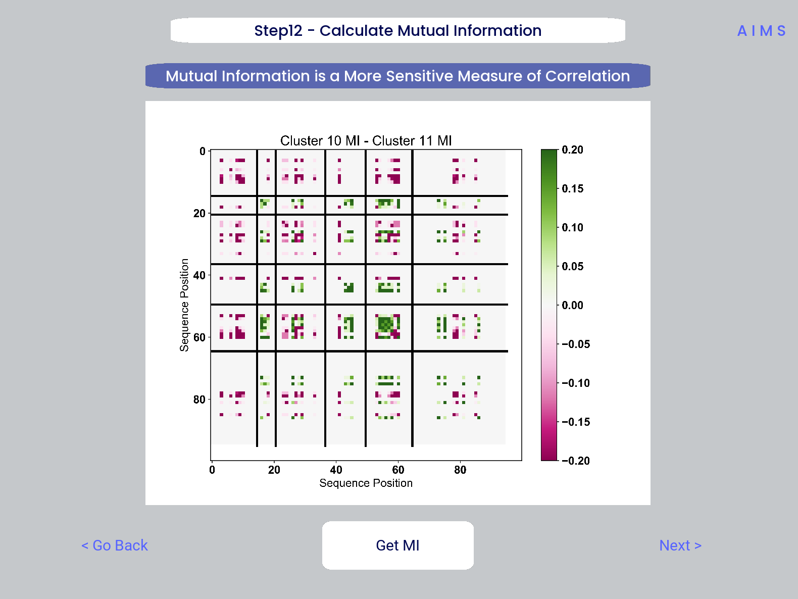

This figure is saved as "MI.pdf/png". The raw information matrices are saved as "MI_mat1.dat" amd "MI_mat2.dat", and should be symmetric matrices with shape # AIMS postions x # AIMS positions. 

.. note::
   Shannon entropy and mutual information are always positive, i.e. there is no "negative information", so we can be confident that negative values in this figure mean "higher mutual information in the second group" rather than "negative mutual information in the first group".

**Step 13: Visualize Amino Acid Frequencies**

In this step, we calculate the position sensitive amino acid frequnecy for each analyzed cluster or group, and plot the difference. The simply reports these differences in frequency, with a positive value (green) indicating higher frequency of a given residue at a given position in the first group (here "Cluster 10") and a negative value (pink) indicating higher frequency in the second group (here "Cluster 11").

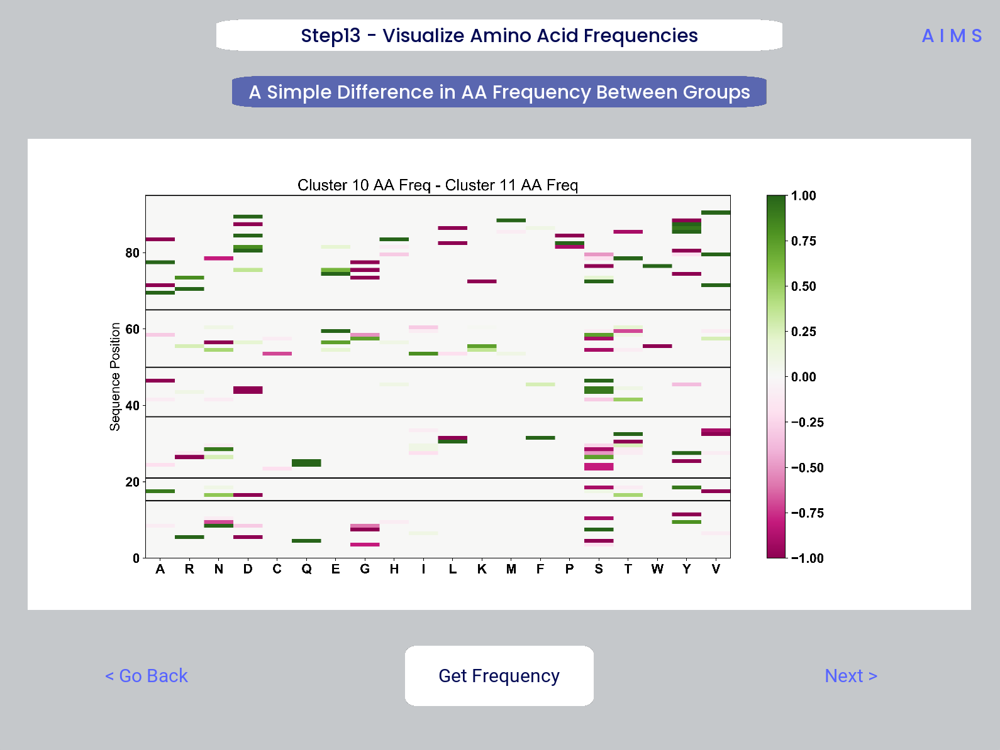

This figure is saved as "frequency.pdf/png". The raw position senesitive frequencies for each cluster or group are saved as "frequency_mat1.dat" amd "frequency_mat2.dat", with each row corresponding to the AIMS position, and each column corresponding to the amino acids in the same order as they are presented in the figure. 

**Step 14: Linear Discriminant Analysis**

In the original eLife manuscript, linear discriminant analysis was used to classify antibody sequences as "polyreactive" or "non-polyreactive" (see https://elifesciences.org/articles/61393). In this step, we use the same framework to instead classify either the selected clusters or the user-defined groups analyzed in the previous steps. For a deeper description of linear discriminant analysis, see :ref:`core`. So, while in the eLife manuscript the linear discriminant is a proxy for polyreactivity, in the AIMS GUI the linear discriminant is a metric of "more like group 1" or "more like group 2". An example of overfit data (from a cluster analysis, left) and of a proper application of linear discriminant analysis (from a group analysis, right) can be seen below:

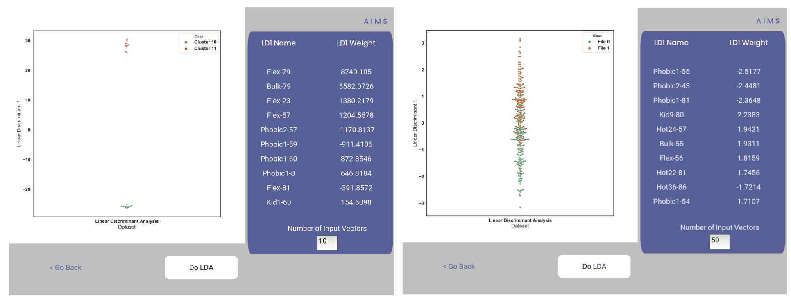

.. warning::
   Care must be taken not to overfit. If the number of input vctors is greater than (or similar to) the size of one of your datasets, you will likely overfit the data

The LD1 “names” and “weights” refer to the top ten weights that most strongly split the data. In other words, LDA not only functions as a classifier, it also works as a means to identify the biophysical features that best discriminate between two datasets. The generated figure is saved simply as "lda.pdf/png" while the raw data to recreate the plot is saved as "lda_data.dat". Lastly, the linear weights from which the linear discriminant is generated are saved as "lda_weights.dat". The AIMS GUI will show at most the top ten weights, but users can split their data using as many features as they choose (assuming this number is less than the available features).

.. note::
   You can tell that the left panel is overfit in part by the exaggerated weights, compared to the non-overfit weights in the right panel

**END Ig Analysis**

Congratulations for making it through the GUI walkthrough, and thanks again for using the software! Be sure to reach out if any part of this walkthrough is unclear or if there are questions/features you would like addressed in greater detail.

.. _AIMSmhc:

MHC and MHC-Like Analysis with AIMS
------------
While a niche application of the software, AIMS readily extends to the analysis of any evolutionarily conserved molecules with specific regions of variability. MHC and MHC-like molecules fit very well into this category, and in the first published usage of AIMS, these moleclules were analyzed using the same tools as the immunoglobulin analysis. This section highlights the unique portions of the MHC analysis, and reiterates many of the points discussed in the above section for users only interested in the MHC and MHC-like analysis.

.. note::
   Much of this documentation will be a verbatim repeat of the steps outlined above in the :ref:`AIMSig`, save for the first two steps which differ significantly

**Step 1: Loading in Data**

FASTA files should be aligned sequences, with a minimum of 2 sequences per file, and a minimum of 2 FASTA files per program run. For the MHCs, formatting should just be in normal FASTA format. For following along with the analysis, load in “mhc_testData/“cd1_seqs.fasta”.

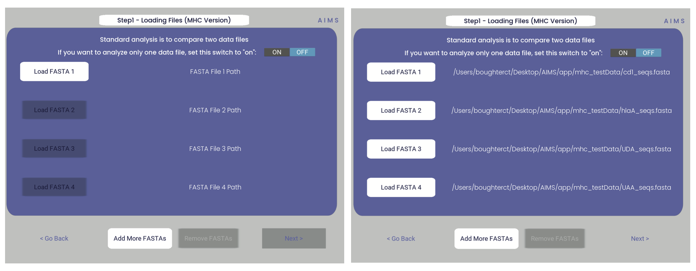

**Step 2: Locate Helices and Strands**

So this is my least favorite part of the software, but it turns out this is the most efficient way to do things. Here, we explicitly say where in the alignments the strands/helices start. In an attempt to make this slightly less annoying, I’ve made it possible to create pre-formatted matrices for repeated analysis.

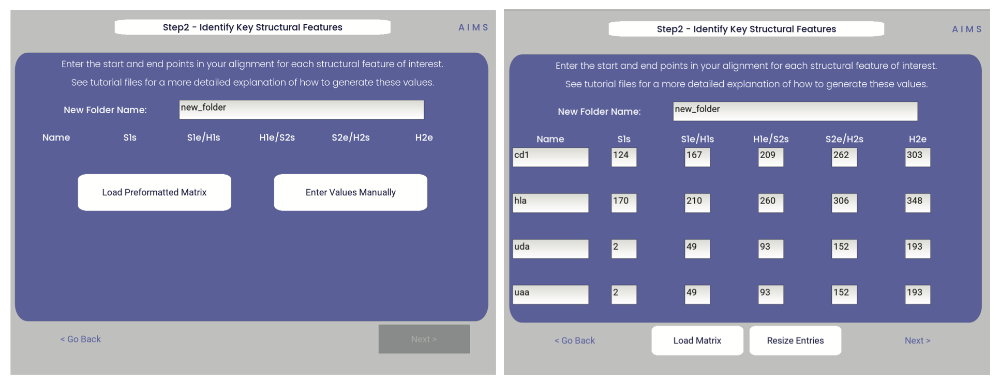

For this example, from mhc_testData load in ex_cd1d_hla_uda_uaa_ji.csv. So for FASTA1, Strand 1 starts (S1s) at position 124, Strand 1 ends (S1e) at pos 167, Helix 1 starts (H1s) at this same position. And so on... Lastly, ”new_folder” is where output figures will be saved. Change this to whatever you want your folder name to be. Each run overwrites the figures, so maybe change to ”run1”, ”run2”, etc.

How do we locate helices and strands? NOTE, for this tutorial, this step has been done already
We first align molecules of interest within a single group
We then take a representative molecule (here human CD1d) and put it through our favorite structure prediction (Phyre, PsiPred, etc.)
When then go back and find where in the alignments a structural feature roughly begins
Here S1 starts at ”FPL” which occurs at alignment position 127. We add 3 amino acids of buffer space (optional, you can change this if you want) and you can see on the previous slide S1s = 124

Already figured out locations of Helices/Strands (based on provided FASTA files):
For the ji_cartFish we have: 2,49,93,152,193
For the cd1d_seqs.fasta we have: 124,167,209,262,303
For the hlaA_seqs.fasta we have: 170,218,260,306,348
For cd1_ufa_genes.fasta: 22,66,105,158,199
For UAA or UDA fasta: 2,49,93,152,193
In the future, I hope to identify these helices and strands automatically within the software, but I haven’t found anything suitable yet for doing so

**Step 3: Generate the Sequence Matrix**

In this step, we begin the dive in to the automated portion of the "Automated Immune Molecule Separator", generating an AIMS-encoded matrix form of the sequences in our dataset. Most steps from here on require a simple clicking of a button, here "Get Matrix", and moving on to the next step. Users are given the option to change the AIMS aligment scheme, with "Center Align" as the default option. See the :ref:`core` section of the documentation for more information on these alignment schemes. As an example, both the central alignment (center panel) and the bulge alignment (right panel) are highlighted below. 

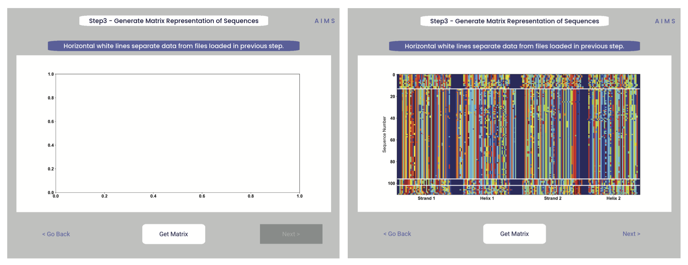

Congrats! You’ve generated your first piece of data using this software. You might notice that your image quality is poor for figures shown in the app, this is because the software shows *png files. Don’t worry, both a *png and a higher-quality *pdf version of the plot are saved in whichever directory you specified in Step 2. This is true for subsequently generated figures.

Additionally, as you move through the sequential steps of the GUI, keep in mind that **all generated figures have corresponding raw data saved to a *.dat file**, should the user want to re-plot the data using a different color scheme, different plotting application, etc. For screen 3, the output figures are matrix.png and matrix.pdf, while the ouput raw data is saved as raw_matrix.dat.

**Step 4: Generate High-Dimensional Biophysical Matrix**

In this step, we generate the high-dimensional biophysical property matrix that will be used in all downstream analysis. We then have the option to include or exclude files from the clustering that will happen in the next step. If only one or two datasets are included in the analysis, all input data must be included in the clustering. Again, we simply press the “Generate Matrix” button, shown below, and then users can move on to the next step. 

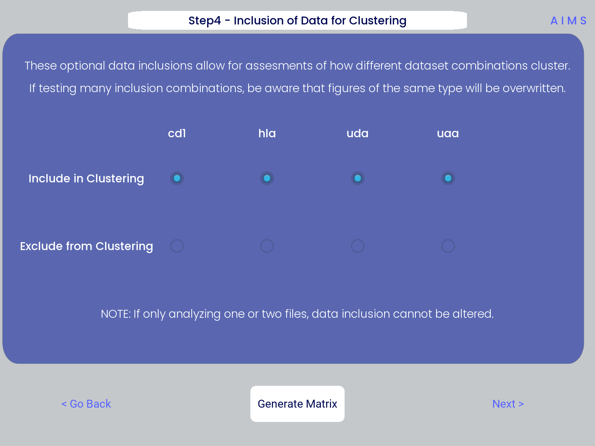

.. note::
   Don’t worry if this step takes a little while, especially for larger datasets. This will be the slowest and most memory-intensive step in the analysis.

While most users may not want to leave any datasets out of the clustering of Step 5, there are some interesting applications of AIMS where the exclusion of certain datasets has interesting impacts on receptor clustering. It is important to remember that the UMAP and PCA dimensionality reduction steps are strongly dependent on the input data. Learn more about this input data dependence in the :doc:`AIMS_cluster` section.

**Step 5: Dimensionality Reduction and Receptor Clustering**

The goal in this step is to take that large biophysical property matrix generated in the previous step, and reduce this high-dimensional matrix down to two or three composite dimensions, and then cluster the receptors projected onto this space based upon distance in this projected space. This step is perhaps the most involved in the GUI, with the most customizable options. Hence the dedicated :doc:`AIMS_cluster` section detailing the possibilities for this analysis. 

First, the user must decide if they would like to reduce dimensionality on Net Average Properties, i.e. the biophysical properties averaged across entire receptors, or on the Position Sensitive Properties, i.e. the amino acid biophysical properties at every position on every receptor.

Next, the algorithm used for this dimensionality reduction must be chosen. Users can choose either Principal Component Analysis (PCA) or Uniform Manifold Approximation and Projection (UMAP), and additionally choose to visualize these projections in two- or three-dimensions. Once these options are chosen, click the "Reduce Dim" button to visualize these options. More options can be tested and the projection re-visualized as many times as the user desires.

Lastly, the data is then clustered using one of three algorithms, either K-Means, OPTICS, or DBSCAN clustering. Users must also define, for each of these algorithms, a tunable parameter that determines the size of the clusters generated. We can see each of these options, and the default values for the tunable parameters, in the screenshots below.

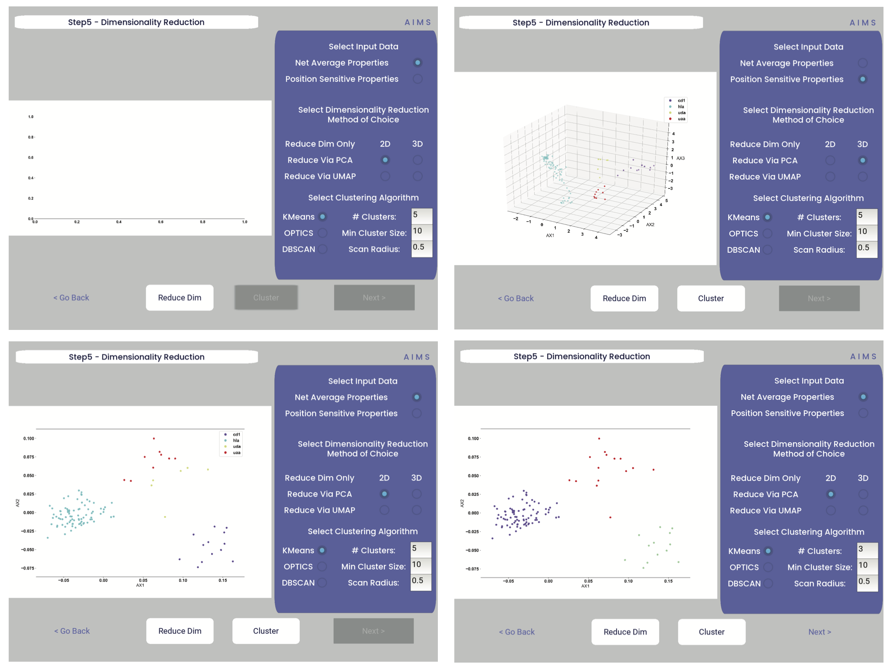

For more detail on how these dimensionality reduction and clustering algorithms work, as well as details on the tunable parameters, please see the :doc:`AIMS_cluster` section.

In the above screenshots, we see first the default screen (top left), then the three-dimensional PCA projection (top right), followed by a Kmeans clustering with 5 clusters (bottom left), and lastly an OPTICS clustering with a minimum cluster size of 5 (bottom right). Users should note that Kmeans will cluster all sequences in the dataset, while OPTICS and DBSCAN will exlude sequences that are not found at a sufficient density in the projection. These unclustered sequences are grayed out in the resultant displayed figure.

There is no one right answer to determining the "best" dimensionality reduction or clustering algorithm, so users are encouraged to try a range of options to determine which combination makes the most sense for their data. Importantly for this step, generated figures and data from each dimensionality reduction and clustering algorithm are **not overwritten**. You will see in the output directory descriptive filenames that correspond to each option used. Importantly however, for each given clustering algorithm only one file will be saved. If, for instance, you cluster your data using the Kmeans algorithm with "# Clusters" set to 5, then run it again with "# Clusters" set to 10, the output figures and data will reflect only the "# Clusters = 10" configuration. Lastly, raw data outputs "umap_3d.dat" or "pca_3d.dat" give the location of each sequence in the reduced dimensionality projection. Raw data outputs for the clustering steps "optics_3d.dat" or "dbscan_3d.dat" reflect the cluster membership of each given sequence, with the order of sequences preserved based upon your input datasets.

.. note::
   Whichever projection and clustering algorithm the user is currently viewing when moving to the next step is what will be used in all downstream analysis

**Step 6: Visualize and Analyze Clustered Sequences**

At this stage, we visualize the clustered sequences from the previous step. First, the user must hit the "Visualize Cluster" button, then after visual inspection of the clusters and sequences, the "comparison clusters" can be selected. The goal of this step is to determine whether the user wants to compare two biophysically distinct clusters which were identified in the previous step, or compare across the input datasets. We can see in the screenshot below how this works:

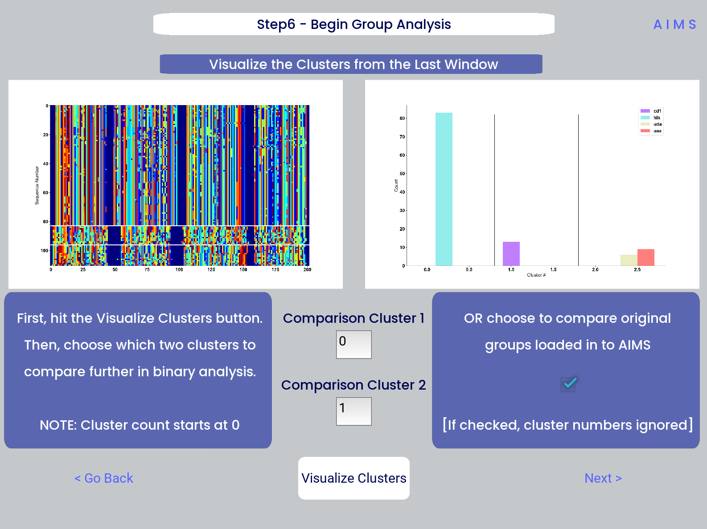

After the cluster visualization is complete, we see in the right panel, left figure that the matrix from step 3 is rearranged to reflect the clustered sequences, with higher sequence conservation (colors in the matrix) evident within each cluster. In the right figure, we see the sequence count of each input dataset in each cluster.

From this information, the user can determine which clusters they would like to analyze by entering values in the "Comparison Cluster" boxes. The cluster count starts at zero, and the user can infer the last cluster number from the figure on the right. The amino acid sequences from the selected clusters will be saved to the output directory as "clust2seq_#.txt" where the "#" is the cluster number for each respective dataset.

If the user instead is still most interested in comparing the input datasets, the checkbox on the right side of the screen can be checked, ignoring the clustering of the data (but still saving the results in the output directory!).

.. warning::
   The clustering algorithms are stochastic, and so cluster ID and cluster membership may change each time the software is run. For instance, in this walkthrough I use clusters 10 and 11 for downstream analysis, but users trying to replicate this analysis may have different sequences in clusters 10 and 11. This is important both for comparisons in this walkthrough as well as creating reproducible analysis.

**Step 7: Define Comparison Classes**

Here, we separate our loaded data into separate classes for downstream analysis, assuming the user opted not to compare clustered sequences. As a default, each loaded dataset is assigned to its own unique group, but the user may group these datasets however they choose by assigning matching group numbers to datasets they want analyzed together.

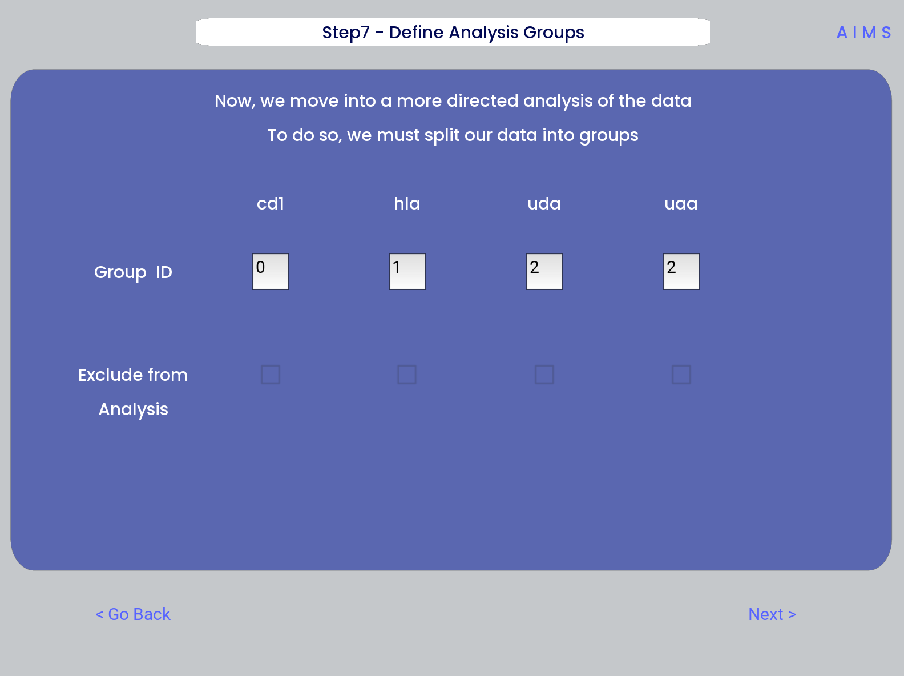

.. warning::
   If comparing more than two distinct groups, some of the analysis will be unavailble. These analyses include mutual information analysis, amino acid frequency characterization, and linear discriminant analysis. Each of these analyses require binary classifications of the data.

**Step 8: Visualize Averaged Position Sensitive Biophysical Properties**

In this step we look at average biophysical properties as a function of sequence space, part of our special “positional encoding”. At this stage in the walkthrough we won't bother showing the "before" snapshots of the GUI, as the only options are to press the button which generates the plot, and then move on to the next step. However, if you're trying to compare the results to the data we get in this walkthrough, the generated plots are quite useful:

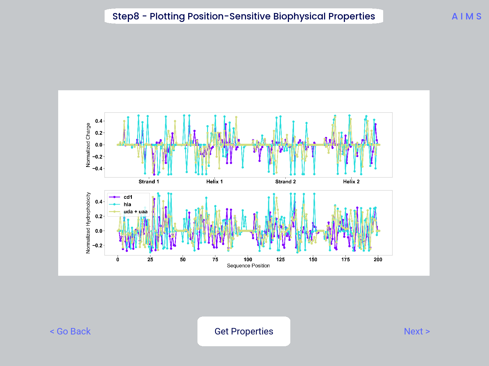

.. note::
   Standard deviations are not shown, and ideally these would be calculated via bootstrapping

The figure in this step is saved as "pos_prop.pdf/png", while the raw data is saved as "position_sensitive_mat#.dat" where the "#" again corresponds to the selected cluster number, or if comparing the original input datasets, the user-defined group number. This data file has as many rows as the number of sequences in the selected cluster or group, and has 61 x # AIMS positions columns. Ideally this data would be saved as a tensor of shape # sequences x 61 x # AIMS positions, however, this would require saving the data as a numpy object, which would be less friendly to other programming languages for replotting and reformatting. The 61 here refers to the 61 biophysical properties of AIMS (listed in the :ref:`bphysProp`). 

As a concrete example, cluster 10 in this walkthrough has 10 sequences, and 95 AIMS positions. So the first row of the position_sensitive_mat10.dat file here corresponds to the first sequence (which can be found in the "clust2seq_10.dat" output). The first 95 columns in this row correspond to the position sensitive charge (biophysical property 1 of 61). The next 95 columns correspond to the position sensitive hydrophobicity (biophysical property 2 of 61). And so on. 

**Step 9: Visualize Raw Position Sensitive Biophysical Properties**

In this step, we visualize the position sensitive charge for all clones, not averaged. This figure can help provide a sense of how reliable the averages of the previous step are. Like all biophysical properties in AIMS, the charge is normalized, hence the minimum and maximum on the scales not equaling 1.

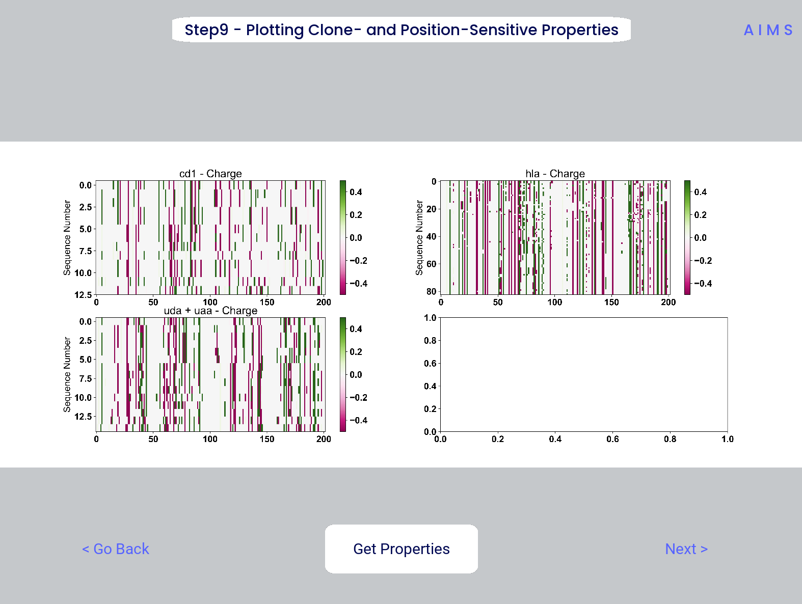

These figures are saved as "clone_pos_prop.pdf/png". This figure helps to understand the figure generated in Step 8, which is simply this figure averaged over the y-axis. It is additionally important to note that the positional encoding in Steps 8 and 9 are consistent with the alignment scheme selected in Step 3, either central, bulge, right, or left aligned.

**Step 10: Visualize Net Biophysical Properties**

In this step, we are averaging the biophysical properties over all positions and all receptors. In other words, effectively averaging the figures generated in Step 9 over both the x- and the y-axes. 

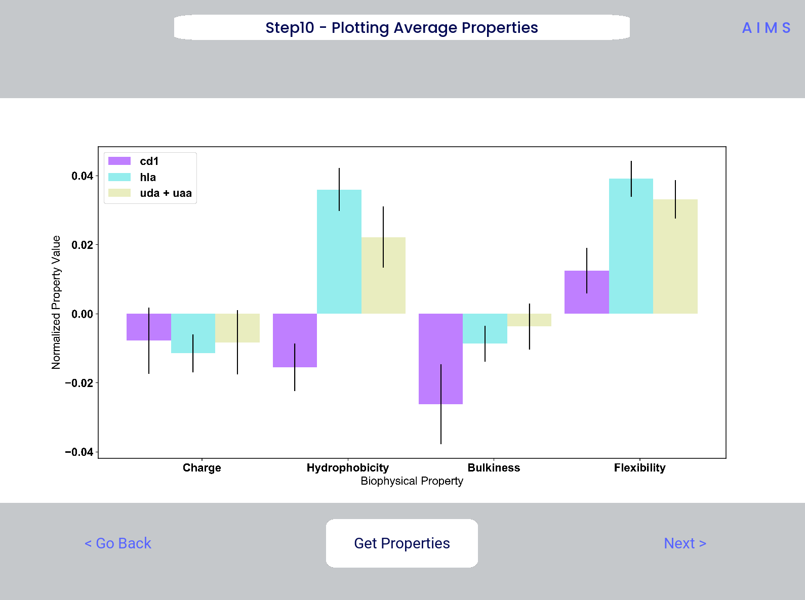

.. note::
   A large standard deviation in these plots are to be expected, especially if users are analyzing original input datasets rather than selected cluster subsets

This figure is saved as "avg_props.pdf/png", while statistical significance, as calculated using Welch's t-Test with the number of degrees of freedom set to 1, is saved as "avg_prop_stats.csv".

**Step 11: Calculate Shannon Entropy**

In this step, we are calculating the Shannon Entropy of the chosen datasets, effectively the diversity of the receptors as a function of position. For more information on the Shannon Entropy, as well as the Mutual Information discussed in the next step, view the Information Theory section of the :ref:`core`.

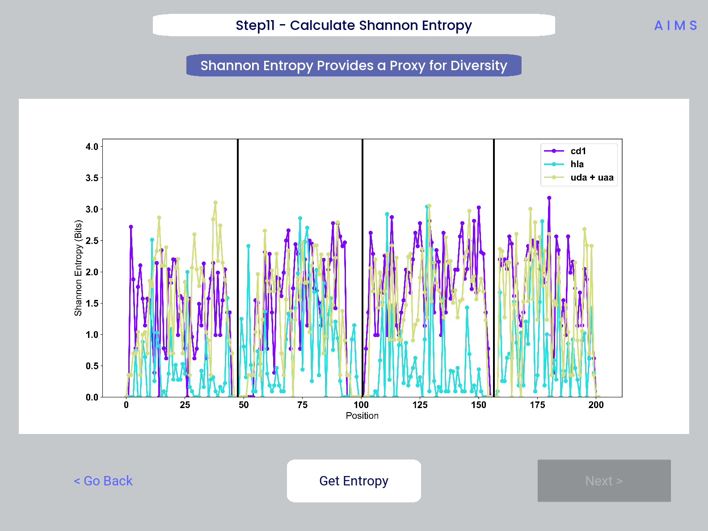

This figure is saved as "shannon.pdf/png".

.. note::
   Due to the requirement for a binary comparison in subsequent steps, this is the last GUI screen if users are comparing more than 2 groups

**END MHC Analysis **

Due to the analysis of three distinct groups in this walkthrough, the MHC analysis ends here at step 11. However, as discussed previously these steps are identical to those in the immunoglobulin analysis. If you'd like to learn more about steps 12, 13, and 14, go back to the end of the :ref:`AIMSig`.

Otherwise, congratulations on completing the AIMS MHC walkthrough! Thanks for using the software, and be sure to reach out if there are any outstanding questions/unclear sections of this walkthrough.