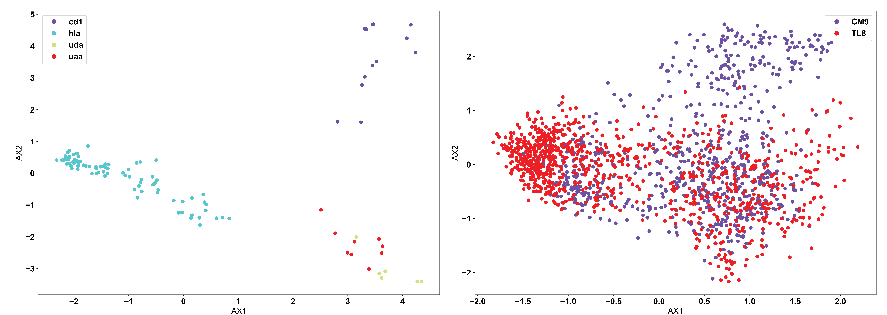
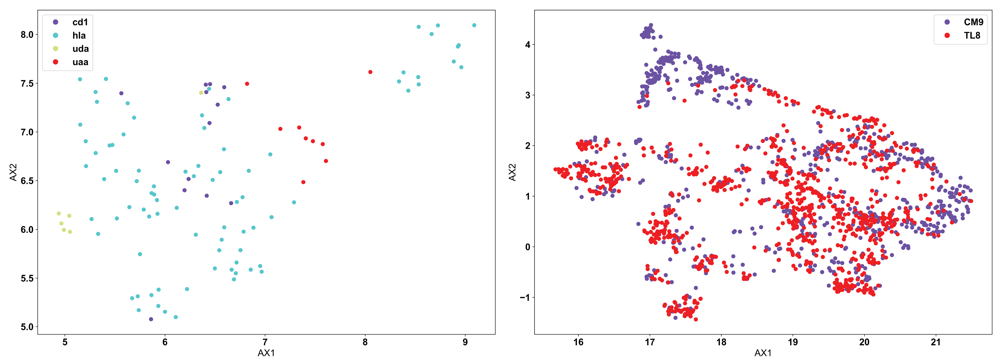
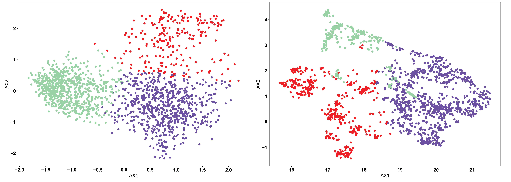
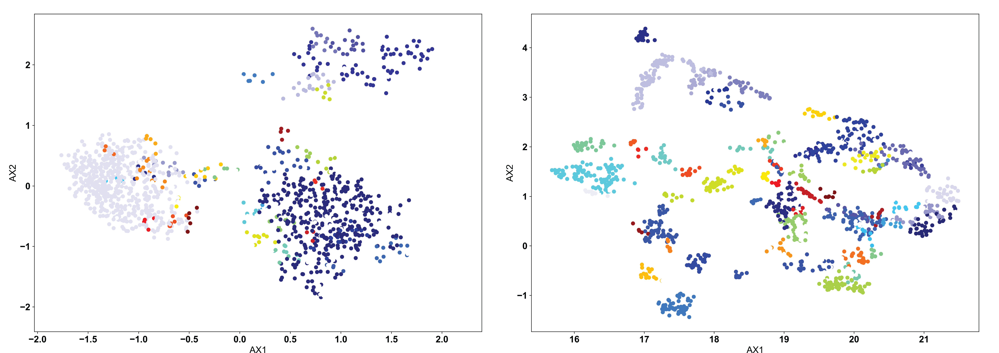
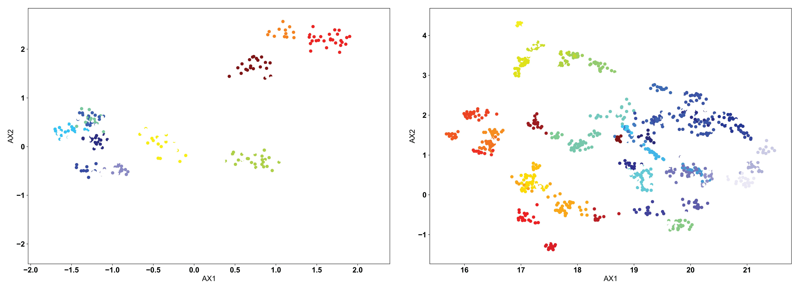

AIMS Cluster
=====

As discussed in the :ref:`core`, the key step in the AIMS analysis pipeline is the generation of a high-dimensional biophysical property matrix based upon the initial AIMS position-sensitive sequence encoding. This high-dimensional matrix provides an exceptional opportunity to identify biophysically similar clusters of receptors. The two steps in generating these clusters are discussed below in the :ref:`DimRed` and :ref:`Clustering` sections.

A key concept of this entire page is that there is no single "correct" way to reduce dimensionality and cluster a given dataset. The type of data being analyzed and the information users are trying to glean from this data will be key for determining the best combination of approaches. Users are encouraged to try multiple approaches, and glean information about the data from each approach.

.. _DimRed:

Dimensionality Reduction
------------

In order to properly cluster our sequences and visualize these clusters for user interpretation, the high-dimensional biophysical property matrices must be projected onto a lower dimensional space. AIMS offers three options for generating this projection while best preserving the key features of the high-dimensional biophysical property space.

**Principal Component Analysis**

The preferred dimensionality reduction technique utilized in AIMS is principal component analysis (PCA). As a linear and deterministic analysis approach, PCA is the most interpretable and reproducible approach. The principal components identified give back the dimensions of the data with the highest variance in the dataset. Each principal component is an orthonormal vector spanning this dimension of highest variance. So, in a way, you can consider the most distal sequences in the projected PC space to be the most "biophysically distinct" within your dataset.

Regarding this linearity, the principal components themselves are simply linear combinations of the input biophysical properties. So, if your biophysical property matrix has 90 vectors (columns) for each sequence, then the principal components will weight all 90 of these vectors by some factor. Each individual sequence is then projected onto these principal components via a simple sum. So for instance, if principal component 1 (PC1) has weights 0.3 - Charge, 0.15 - Phob1, 0.05 - Bulk, etc. then the resultant projection of sequence 1 onto PC1 will be 0.3*Seq1_charge + 0.15*Seq1_phob1 + 0.05*Seq1_bulk1 + ... Each principal component has different weights, giving the final projection into three dimensions. The top 10 features that determine the three principal components calculated in AIMS, and their weights, are included in the output files "pca_compX_top10.dat". This has the added benefit that users can go back and determine which features are the most important for generating distinct clusters of receptors.

Regarding the determinism of PCA, for any given biophysical property matrix, i.e. any fixed input data, the exact same principal components will be identified. This is because the principal components are fundamental linear algebraic features of the matrix in question. For further reading into how PCA works and some of the mathematical fundamentals behind it, interested users can look into the general concept of spectral decomposition. For those really interested in a deep dive into linear algebra, David C. Lay's "Linear Algebra and Its Applications" was a particularly useful textbook to read through.

Moving from the fundamentals of PCA, we can see below the use of PCA in AIMS to analyze two different datasets:

In line with what was discussed at the top of this page, it appears that PCA clusters the MHC data (left) quite well, but has a hard time of distinguishing a large portion of the TCR data (right). This is due to the nature of the input data. CD1 and HLA are two strongly biophysically distinct human molecules, whereas UDA and UAA are shark molecules. We see then that CD1 and HLA are distal in the PCA projection, while UDA and UAA are localized to the same region. Conversely, the TCRs in the right panel, specific to the CM9 and TL8 antigens of the Simian Immunodeficiency Virus (SIV) have a large number of biophysically similar receptors. This may be due to the nature of the data or could mean that another clustering algorithm is more appropriate in this instance.

**UMAP**

Over the past year or two, Uniform Manifold Approximation and Projection (UMAP, see more details here: https://umap-learn.readthedocs.io/en/latest/ ) has become increasingly popular in immunology as a means of projecting high-dimensional data onto a lower-dimensional space. Unlike PCA, UMAP is neither linear nor deterministic in nature. UMAP uses nonlinear, stochastic methods in an attempt to optimize the projection, with the overall goal of preserving the general structure of the sequences in the high-dimensional space. This means that no information regarding the "key components" or biophysical properties which determine the "closeness" of certain receptors can be gleaned from this projection. Further, it means that unless users set a specific "random_state" in their calling of the UMAP algorithm, there is no guarantee that their projection will be reproducible.

.. warning::
    In the AIMS GUI, the random_state is set to 47 for the UMAP projection, specifically so the results ARE reproducible. This is an introduced bias in the analysis, but guarantees that users can repeat their analysis consistently.

Using the same example input data as used above for the PCA example, we see below how the application of UMAP looks different:

Now, we see the reverse of what was seen for PCA. UMAP does not separate out the biophysically distinct MHC and MHC-like molecules (left), because UMAP is focusing more on the similar features of the molecules rather than the regions of highest variation in the data. MHC and MHC-like molecules are structurally very similar, and the differences are localized only in specific regions of the molecules. In this specific application, PCA is likely the more appropriate algorithm. Conversely, we can see in the TCR data (right) that there are still large regions of biophysically similar TCRs for each antigen specificity. Clearly, this is a fundamental feature of the input data here. We see multiple distinct small clusters of biophysically similar TCRs, compared to the three large clusters in the PCA analysis. Eventual clustering of these data will help to further break down the differences between PCA and UMAP.

**t-SNE**

T-distributed Stochastic Neighbor Embedding (t-SNE) is largely similar to UMAP, in that is looking for a lower-dimensional projection of the data which preserves the general structure of the high-dimensional data. However, use of t-SNE is largely deprecated in AIMS, as it performs much worse than UMAP in all applications tested so far. t-SNE is no longer and option available in the AIMS GUI, but may still be used in the Jupyter notebooks. For more information on t-SNE and its use, see the SKLearn [the python implementation of t-SNE used in AIMS] documentation page (https://scikit-learn.org/stable/modules/generated/sklearn.manifold.TSNE.html).

.. _Clustering:

Picking the Proper Clustering Algorithm
------------

Once the dimensionality of the data has been properly reduced, we can often see by eye what appear to be distinct clusters of sequences. To be more quantitively rigorous, we turn to three specific algorithms to make these clustering decisions for us. Each of the clustering algorithms used in AIMS are distance-based, but their implementation varies in important ways. In some datasets, it may be obvious to the user how or why certain sequences cluster in certain ways. In the examples shown below, we will stick only with a non-obvious clustering example [the TCR data shown above], to show precisely how each algorithm performs in more extreme cases. For more information than is provided here, see the SKlearn clustering [the python clustering module used in AIMS] documentation (https://scikit-learn.org/stable/modules/clustering.html#clustering).

**KMeans**

The KMeans algorithm is perhaps the most conceptually simple of the three used in AIMS, and is the one most appropriate when there exists a strong reason a priori for a specific number of clusters. KMeans requires the user to pre-define the number of clusters, and then optimizes the number of points in each cluster based upon distance metrics. Importantly, how this optimization is done in the KMeans algorithm can cause "obvious" clusters to not be properly identified. The algorithm chooses centroids of each cluster, and attempts to minimize the distance from this centroid in determining the cluster identity. We can see this in the example below:

In each of the panels above, we can see that generally the three clusters are of the same size and shape, with variations in the point density. In the clustered PCA data (left, NClusts=3), we can see that there isn't any obvious reason why the data should be split that way, other than the fact that the algorithm was told to create 3 clusters. This is one of the dangers of using KMeans. The user can create arbitrary clusters of sequences that are not biophysically similar. The clustered UMAP data (right, NClusts=3) shows a similar erroneous clustering, whereby distinct clusters of sequences are included in a single Kmeans cluster, again because the algorithm was told it must search for exactly 3 clusters.

**DBSCAN**

In most AIMS applications, the "proper" number of clusters will not be obvious a priori, so either the OPTICS or DBSCAN algorithm should be used. 
The DBSCAN algorithm is a density based algorithm, identifying regions of high sequence density surrounded by regions of low sequence density. Due to the extremely high variance in the projected landscape of sequences, what constitutes a "proper" change in density must be user defined. In the AIMS GUI, users are responsible for setting a scan radius ('eps' in the AIMS notebooks, following the nomenclature of SKlearn). This radius tells the DBSCAN algorithm to look for clusters of points within a radius of this size. We can see how this looks with a scan radius of 0.2 below: 

Right away, users should notice the difference compared to the KMean example: there are missing points in these figures. Both the DBSCAN and OPTICS clustering algorithms leave out certain points if they do not meet the criteria of what the algorithm considers a proper cluster. This is a key feature of these density-based algorithms, and may or may not be a desirable feature depending on the application. We can see in the clustered PCA data (left) that three large clusters are first identified, followed by a few "islands" of biophysically distinct clusters on the edges of these large clusters. There are no such large clusters in the clustered UMAP data (right), and instead we see that the many distinct biophysically similar TCR clusters appear properly clustered.

**OPTICS**

The OPTICS algorithm is conceptually similar to the DBSCAN algorithm, but with a more user-friendly metric for what constitutes a proper cluster. In the OPTICS algorithm, the user must define the minimum number of sequences that are allowed to be considered a cluster, and the algorithm will go from there in defining clusters based on this minimum number. Each cluster is defined based upon some minimum distance between points, satisfying the minimum cluster number. We can see the example below, with a minimum cluster size set to 10:

Again, as in the DBSCAN-clustered data, we see many unclustered points in both figures, removing sequences that are not strongly similar to others. However, we can see how the lack of explicitly setting a cluster search radius can occasionally cause issues. In the clustered PCA data (left), we see that the large clusters identified in the DBSCAN clustering are left unclustered. Instead, more tightly clustered sequences are identified as distinct clusters. Only through user inspection can the appropriateness of these clusters be identified. Perhaps the DBSCAN clusters are too broad, or perhaps the OPTICS clusters are identifying point mutants of a single sequence, and are too restrictive. We do see however that the clustered UMAP data (right) is largely similar to the DBSCAN results, perhaps performing even better by breaking some larger clusters into smaller groups.

**Conclusions**

With that, you should be properly equipped to use the dimensionality reduction and clustering algorithms available in AIMS to find biophysically similar sequences within your datasets. This guide is meant to help the user, but a more comprehensive understanding should be the goal for all users. As such, more background reading than is available on this page is strongly recommended for long-term AIMS users.